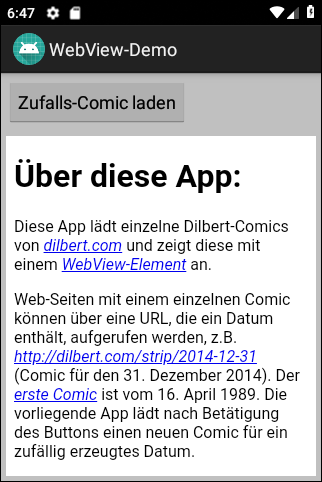

# Android-App "Browser-Demo" #

 

Dieses Repo enthält den Quellcode für eine Android-App, die demonstriert, wie man mit dem
[WebView](https://developer.android.com/reference/android/webkit/WebView)-Element
Web-Seiten aus dem Internet oder in die App eingebetteten Web-Content anzeigt.

 

----

## Screenshot ##

 

 

----

## License ##

 

See the [LICENSE file](LICENSE.md) for license rights and limitations (BSD 3-Clause License).

 
