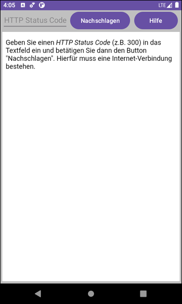

# Android-App "Browser-Demo" #

App demonstrates how to use Android's [WebView element](https://developer.android.com/reference/android/webkit/WebView) to display web pages from the internet or provided as raw resource.

 

Identifiers (names for classes, variables and methods), UI text and (JavaDoc) comments are in German only.

 

----
## Screenshots ##

  

 

----
## License ##

See the [LICENSE file](LICENSE.md) for license rights and limitations (BSD 3-Clause License).
